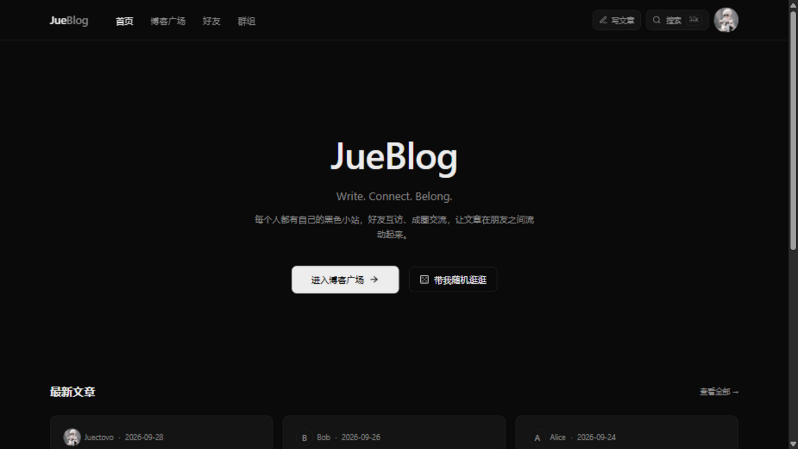
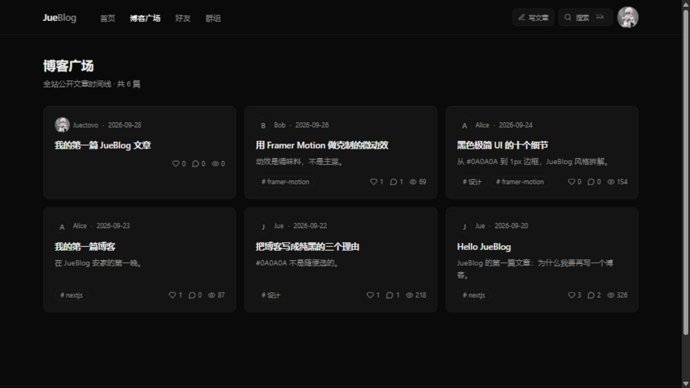
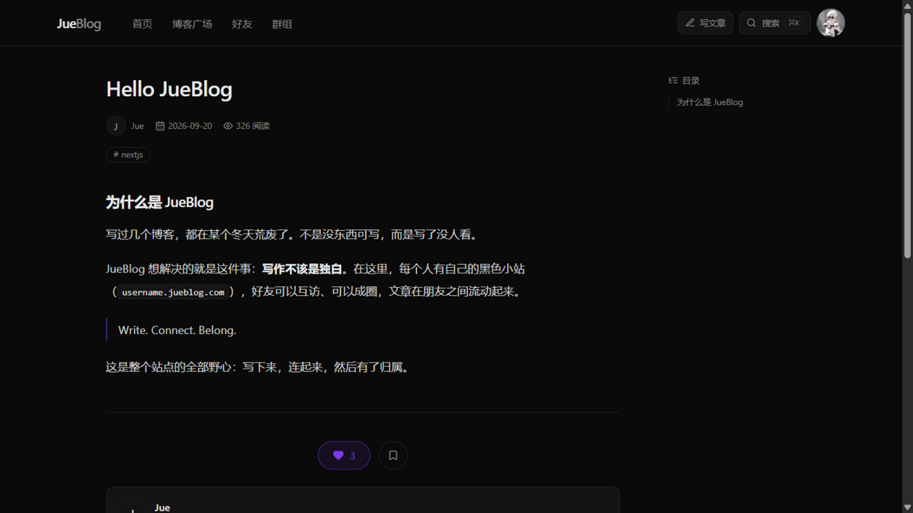
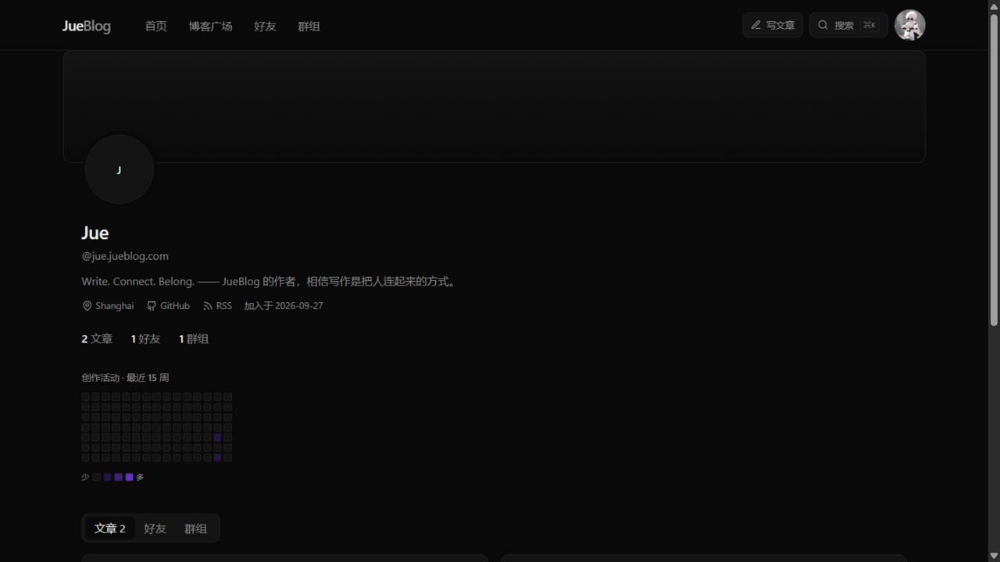
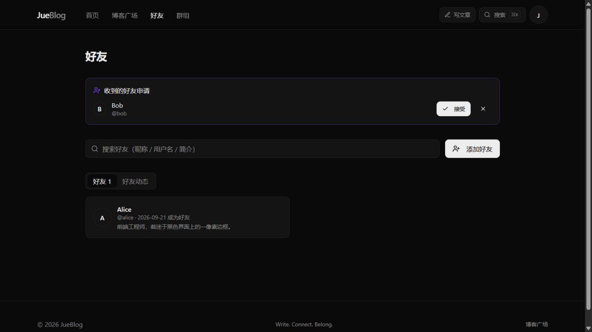

<div align="center">

# JueBlog

**Write. Connect. Belong.**

黑色极简高级风的「个人博客 + 好友互联」平台 —— 每个人都有自己的小站，好友互访、成圈交流，让文章在朋友之间流动起来。

[](https://nextjs.org)
[](https://www.typescriptlang.org)
[](https://www.prisma.io)
[](https://tailwindcss.com)
[](./LICENSE)

**🌐 [在线体验 →](https://jueblog-juectovo.vercel.app)** · 打开后用 GitHub 登录即可玩转全部功能

> **🇨🇳 国内访问提示**：GitHub 的图片代理（`camo.githubusercontent.com`）与 `*.vercel.app` 域名在国内需要代理访问——README 图片无法显示不影响项目功能与代码使用。部署自有域名后可国内直连（见下方部署说明）。

</div>

## ✨ 截图

| 首页 | 博客广场 |
| --- | --- |
|  |  |

| 文章详情（TOC + 评论） | 个人主页（创作热力图） |
| --- | --- |
|  |  |

| 好友系统 | 群组圈子 |
| --- | --- |
|  |  |

## 🚀 功能一览

- **三种登录方式**：GitHub OAuth · 邮箱魔法链接（Resend）· 邮箱密码（bcrypt），同一账号自由切换
- **Markdown 博客**：草稿/公开/私密三态、标签、摘要、封面、浮动目录（TOC）、嵌套评论（两层）、点赞/收藏（乐观更新）、阅读数统计
- **好友互联**：好友申请/接受/删除、**JueBlog Feed**（好友动态流）、创作活动热力图
- **群组圈子**：创建公开/私密群组、成员角色（群主/管理员/成员）、把文章分享到「群组文章墙」
- **个人域名**：注册即得 `username.jueblog.com` 式主页路径 + **RSS 订阅源**
- **博客环 Webring**：一键跳到 JueBlog 上的「下一家」博客
- **AI 摘要**：OpenAI 兼容接口，一键生成文章摘要（可选配置）
- **PWA**：可安装到桌面/主屏幕，支持离线回看已访问页面
- **⌘K 全局搜索**：文章 + 用户即时搜索

## 🛠 技术栈

| 层 | 选型 |
| --- | --- |
| 前端 | Next.js 14 (App Router) · TypeScript · Tailwind CSS · shadcn/ui · Framer Motion |
| 后端 | Next.js Route Handlers（26 个端点，统一响应封装） |
| 数据库 | PostgreSQL (Supabase) + Prisma ORM（17 个模型） |
| 认证 | NextAuth.js v4（GitHub / Email / Credentials + Prisma Adapter，JWT 会话） |
| 邮件 | Resend |
| 部署 | Vercel |

## 🏃 本地运行

```bash
# 1. 克隆并安装依赖（需 Node.js 18+，推荐 pnpm）
git clone https://github.com/Juectovo/jueblog.git
cd jueblog
pnpm install          # npm install 也可以

# 2. 配置环境变量
cp .env.example .env.local
# 填入：Supabase 连接串、GitHub OAuth、Resend Key（详见下方环境变量表）

# 3. 建表 + 灌入演示数据（jue / alice / bob 三位用户 + 文章 + 好友 + 群组）
pnpm prisma:push
pnpm db:seed

# 4. 启动
pnpm dev
# 打开 http://localhost:3000
```

## 🔐 环境变量

| 变量 | 必填 | 说明 |
| --- | --- | --- |
| `DATABASE_URL` | ✅ | Supabase **事务池器**连接串（`:6543/postgres?pgbouncer=true`） |
| `DIRECT_URL` | ✅ | Supabase **会话池器**连接串（`:5432/postgres`），供 Prisma 建表/迁移 |
| `NEXTAUTH_URL` | ✅ | 站点地址（本地 `http://localhost:3000`） |
| `NEXTAUTH_SECRET` | ✅ | `openssl rand -base64 32` 生成 |
| `GITHUB_ID` / `GITHUB_SECRET` | GitHub 登录 | [OAuth App 申请指南](docs/github-oauth-setup.md) |
| `RESEND_API_KEY` | 邮箱登录 | ⚠️ **服务端机密**：只存 `.env.local` 与托管平台后台，严禁提交进仓库；未配置时邮件链接打印在终端 |
| `EMAIL_FROM` | 邮箱登录 | 发件人，如 `JueBlog <noreply@yourdomain.com>`；Resend 测试模式只能用 `onboarding@resend.dev` |
| `AI_API_KEY` / `AI_BASE_URL` / `AI_MODEL` | ❌ 可选 | AI 摘要（OpenAI 兼容接口） |

> **⚠️ 为什么本项目不能部署到 GitHub Pages？**
> GitHub Pages 是纯静态托管，无法运行 API 路由、数据库查询和登录会话。JueBlog 的所有功能（登录、发文、好友、群组）都依赖服务端，请使用 Vercel 等支持 Next.js 的平台部署（见下）。环境变量一律配置在托管平台后台，仓库中只有不含真实值的 `.env.example` 模板。

## ☁️ 部署

推荐 **Vercel**（与 Next.js 同厂，push 即部署）：

1. 推送代码到 GitHub → [vercel.com](https://vercel.com) 导入仓库
2. 按上表配置环境变量（Production）→ Deploy
3. 数据库变更：本地 `pnpm prisma:push` 直推 Supabase

完整图文步骤（域名绑定、OAuth 回调、常见坑排查）：**[docs/DEPLOY.md](docs/DEPLOY.md)**

## 📁 项目结构

```
├── prisma/
│   ├── schema.prisma       # 17 个模型（含枚举/索引/级联策略）
│   ├── seed.ts             # 演示数据（jue / alice / bob）
│   └── queries.ts          # 常用查询示例
├── docs/
│   ├── api.md              # API 文档（全部端点 + 类型）
│   ├── DEPLOY.md           # 部署指南
│   └── github-oauth-setup.md
├── src/
│   ├── app/
│   │   ├── (main)/         # 主站：首页/广场/文章/主页/好友/群组/设置/写作
│   │   ├── (auth)/         # 登录/注册/找回密码
│   │   └── api/            # Route Handlers（auth/posts/friends/groups/users/…）
│   ├── components/         # UI 组件（shadcn/ui + 业务组件）
│   └── lib/                # prisma / auth / mail / api 封装 / 校验
└── scripts/smoke-api.mjs   # API 冒烟测试（31 项断言）
```

## 📄 License

[MIT](LICENSE) © [Juectovo](https://github.com/Juectovo)

---

<div align="center"><i>Write. Connect. Belong.</i></div>
